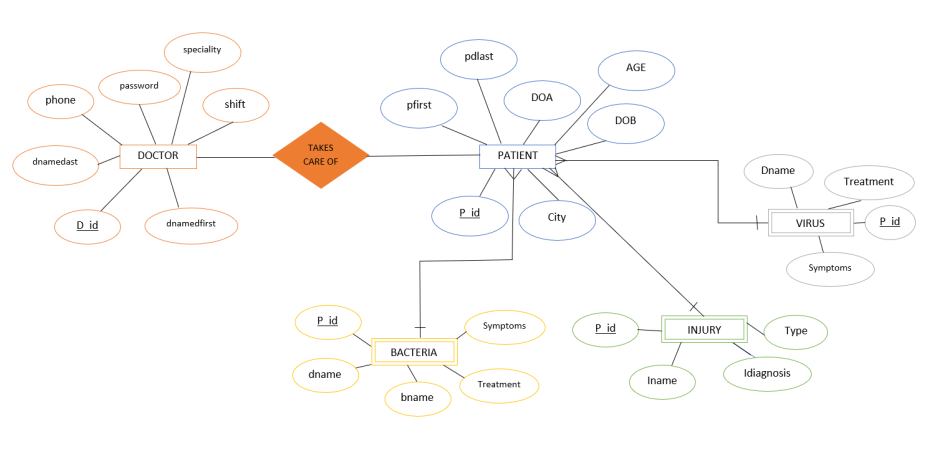
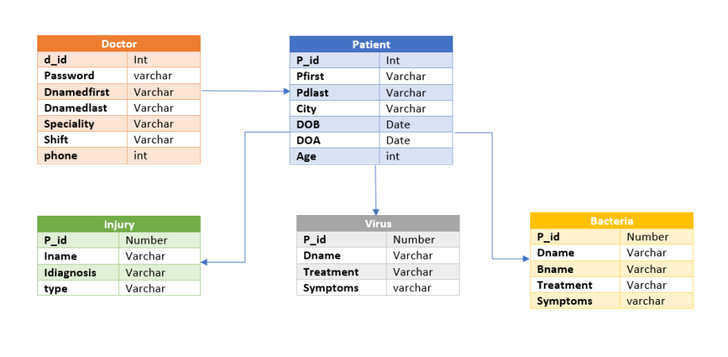

# DBMS Project

  
 
  
A DBMS project to help manage the data base of a hospital using SQL Lite and Python

  

> OVERVIEW OF THE PROJECT:

This is Command Line Application which involves python and sql lite, to help hospital in management. This allows the doctors to look for a patient’s medical record and to see the various sorts of diseases and their symptoms and cures. This also allows doctors to update the disease table. We’ve also implemented a provision which allows doctors to update a patient’s medical record or add a new patient.

  

> REASONS TO CHOOSE THIS TOPIC:

1. We wished of creating a project which would help solve a real world problem faced by hospitals and that is proper management.
2. We wished of challenging ourselves hence we chose hospital data base as there are many tables and attributes which are to be taken into considerations when creating a data base application.

  

> DIFFICULTIES FACED:

1. Connecting the frontend to the backend of the application
2. We were also confused on how to create a database which was independent of database server like my sql.

  

> APPROACH TO SOLVE THE PROBLEM:

1. In order to solve the problem of connecting the backend to the frontend, we had to refer to YouTube video which explained in depth the various aspects of connecting the front end to the back end.
2. To choose a data base which would could run server less, we found about sql lite which comes pre installed with python and was a light base data base which wouldn’t consume much resources to run.
3. In order to avoid unnecessary extra downloads, we chose to use sql lite as this would come pre installed in the python libraries by default which would help avoid extra downloads in order to implement.

  

***

  

> IMAGES:

  

***
